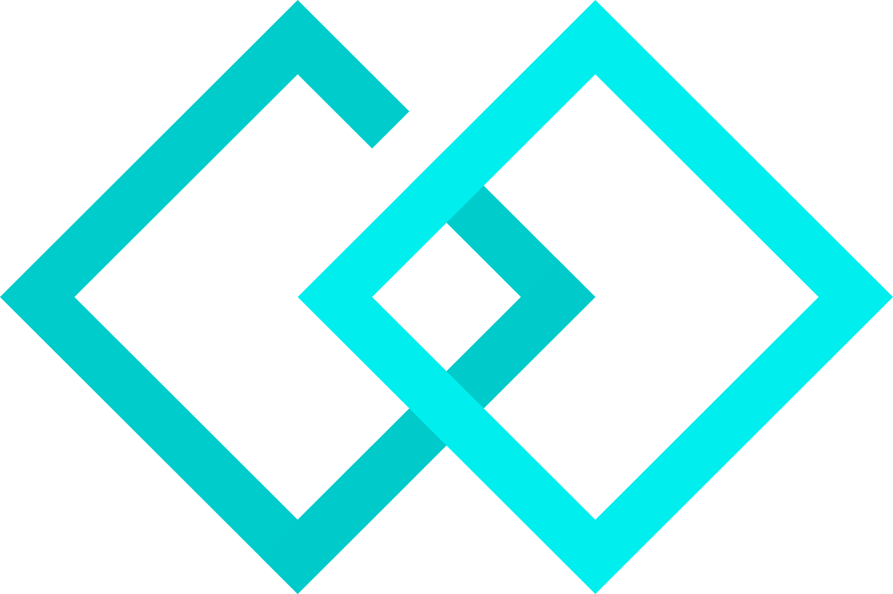

# gobot
 [](https://goreportcard.com/report/github.com/sabafly/gobot) [](https://crowdin.com/project/gobot) [](https://discord.gg/hnNBD8QNmB)  



sabaflyが開発する多機能、便利なディスコードボットです。

もしボットに興味を持ったのならぜひあなたのサーバーにも[このリンク](https://discord.com/api/oauth2/authorize?client_id=1083042729996603412&permissions=8&scope=bot%20applications.commands)を使ってボットを招待してください。

## Documentation

このボットはまだ開発途中です。そのためすべての機能がドキュメントにあるわけではありません。

以下のページでボットの導入方法や機能を確認できます。

[](https://gobot.sabafly.net)

## Docker

gobotはDockerを使用して簡単にデプロイできます。

### GitHub Container Registryから取得

最新版のイメージを取得:
```bash
docker pull ghcr.io/sabafly/gobot:latest
```

特定のバージョンを取得:
```bash
docker pull ghcr.io/sabafly/gobot:v1.0.0
```

### docker-composeを使用した実行

リポジトリに含まれる`docker-compose.yml`を使用して実行できます:

```bash
# 環境変数の設定
cp .env-sample .env
# .env ファイルを編集して必要な環境変数を設定

# コンテナの起動
docker-compose up -d
```

### 利用可能なイメージタグ

- `latest` - mainブランチの最新版
- `develop` - developブランチの最新版
- `v*.*.*` - 特定のリリースバージョン
- `sha-*` - 特定のコミット

### マルチアーキテクチャサポート

以下のプラットフォームに対応しています:
- `linux/amd64`
- `linux/arm64`

Dockerが自動的にお使いのプラットフォームに適したイメージを選択します。

## Contributing

コントリビュートはいつでも歓迎していますが、以下の項目を守ってください。

- 始めに追加する機能、修正する問題についてIssueを開いて議論ができるようにします。
- なるべく既存の命名規則に従うようにします。
- 大規模な機能追加をする前にそれについて議論します。
- mainブランチに対してプルリクエストを作成します。

## Special Thanks

[Crab55e](https://github.com/crab55e) - gobot及びsabaflyのロゴを作成
