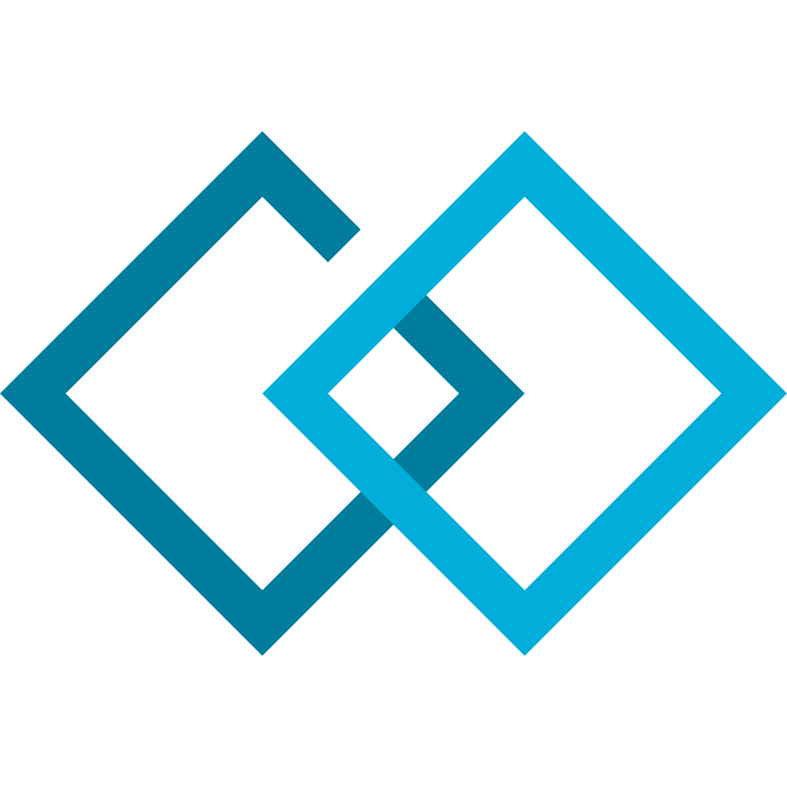

# gobot
     

sabaflyが開発する多機能、便利なディスコードボットです。

もしボットに興味を持ったのならぜひあなたのサーバーにも[このリンク](https://discord.com/api/oauth2/authorize?client_id=1083042729996603412&permissions=8&scope=bot%20applications.commands)を使ってボットを招待してください。

## Documentation

このボットはまだ開発途中です。そのためすべての機能がドキュメントにあるわけではありません。

以下のページでボットの導入方法や機能を確認できます。

## Contributing

コントリビュートはいつでも歓迎していますが、以下の項目を守ってください。

- 始めに追加する機能、修正する問題についてIssueを開いて議論ができるようにします。
- なるべく既存の命名規則に従うようにします。
- 大規模な機能追加をする前にそれについて議論します。
- mainブランチに対してプルリクエストを作成します。

## Special Thanks

[Crab55e](https://github.com/crab55e) - gobot及びsabaflyのロゴを作成
